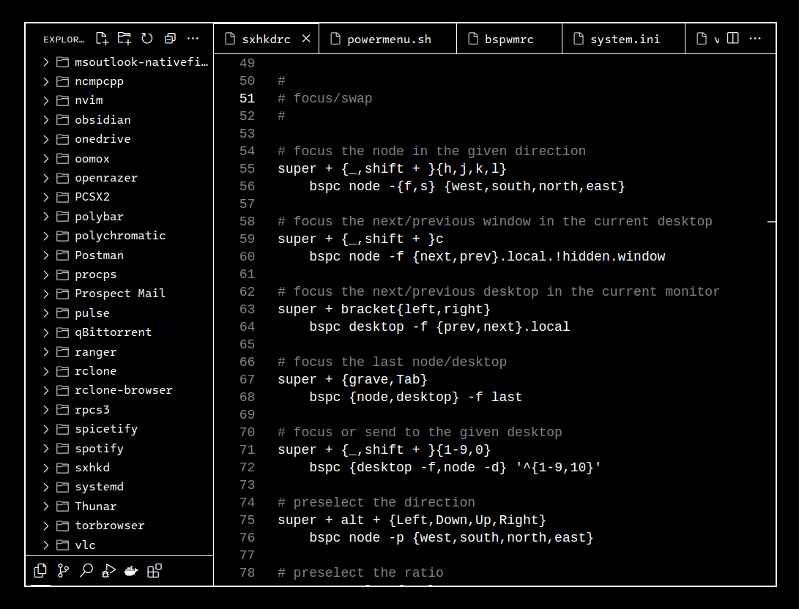

# Monochromy
A high-contrast minimalist theme for [Visual Studio Code](https://code.visualstudio.com/).
## Easy Installation
* Directly [from the Marketplace](https://marketplace.visualstudio.com/items?itemName=samirky.monochromy).

or
* Launch **Quick Open:** `(Ctrl+P)`, paste the following command, and press enter.
```
ext install samirky.monochromy
```
## Manual Installation
* Download .vsix from <code><a href="https://github.com/samirbugueno/monochromy-vscode-theme/releases">Releases</a></code> or <code><a href="https://marketplace.visualstudio.com/items?itemName=samirky.monochromy">Marketplace</a> > Resources > Download Extension</code>, and install it with <code>code --install-extension <file.vsix></code>.
```bash
# Download .vsix
wget -q https://github.com/samirbugueno/monochromy-vscode-theme/releases/download/1.1.0/monochromy-1.1.0.vsix
# Install
code --install-extension !$
```
## Screenshot
<p align="center"></p>
